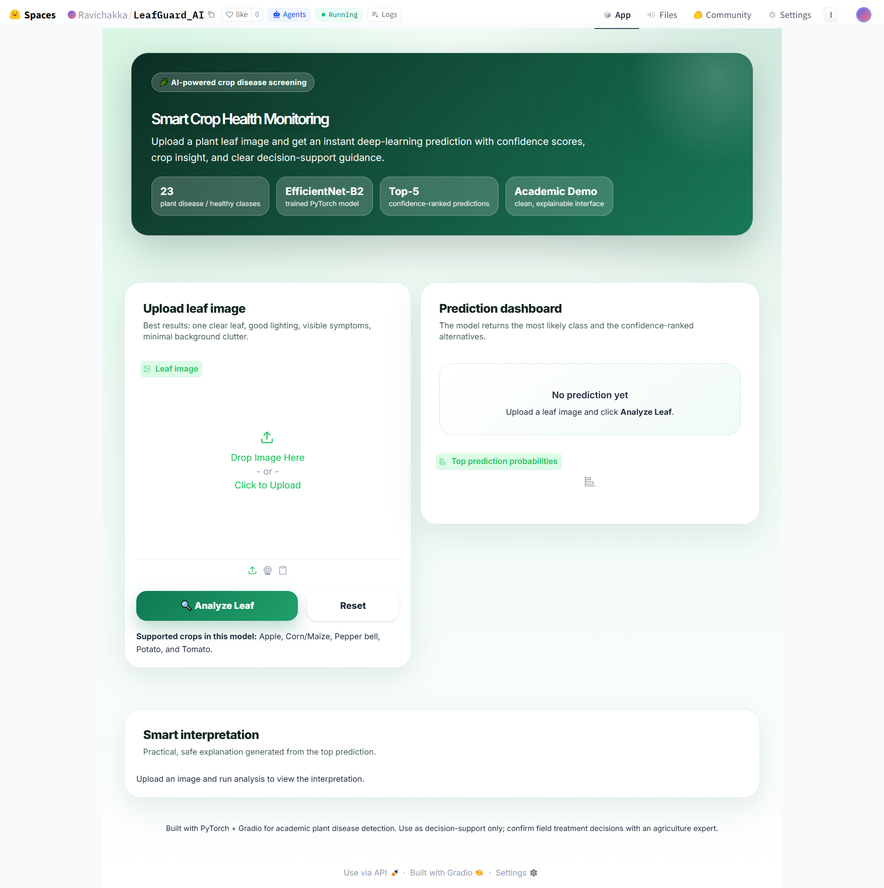
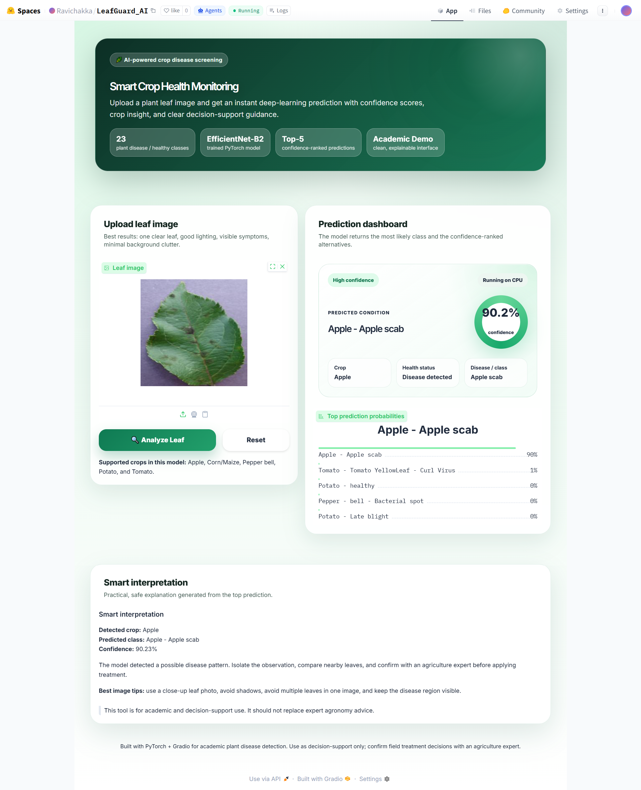
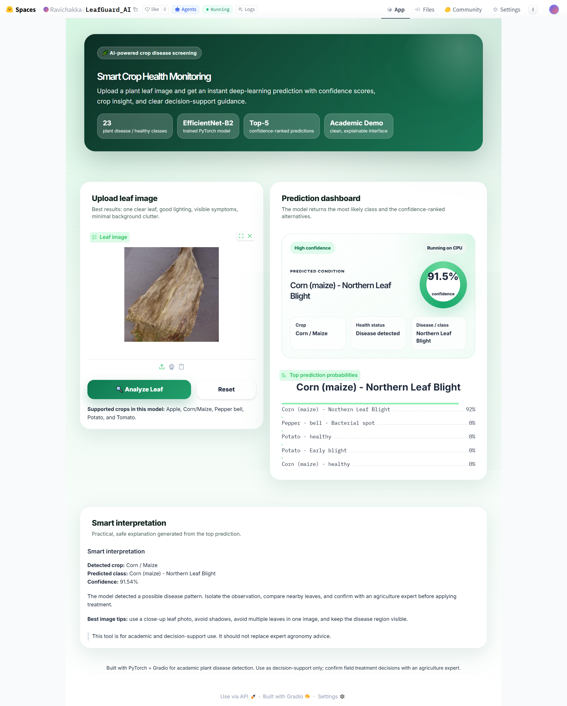

# Smart Crop Health Monitoring — LeafGuard AI

**LeafGuard AI** is a Gradio-based plant leaf disease screening application that uses a trained deep-learning model to classify crop leaf images and return confidence-ranked predictions.

This repository is designed as an **inference and deployment codebase**. Model training is completed separately in Kaggle, and the exported model artifacts are reused locally in VS Code and on Hugging Face Spaces.

## Live Demo

Try the deployed application here:

[LeafGuard AI on Hugging Face Spaces](https://huggingface.co/spaces/Ravichakka/LeafGuard_AI)

## GitHub Repository

Main project repository:

[AIProject GitHub Repository](https://github.com/Nagasai-10/AIProject)

> **Important:** The runnable inference application code is inside the `End_to_End_code/` folder.  
> After cloning the repository, always move into `End_to_End_code/` before installing requirements, verifying artifacts, or running the app.

## Quick Clone and Run

```bash
git clone https://github.com/Nagasai-10/AIProject.git
cd AIProject/End_to_End_code
python -m venv .venv
```

### Activate environment

**Windows CMD / PowerShell**

```bash
.venv\Scripts\activate
```

**Git Bash on Windows / macOS / Linux**

```bash
source .venv/Scripts/activate
```

> On macOS / Linux, use:
>
> ```bash
> source .venv/bin/activate
> ```

### Install and run

```bash
pip install -r requirements.txt
python scripts/verify_artifacts.py
python app.py
```

After running `python app.py`, open the local Gradio URL shown in the terminal.

## Project Overview

The application allows users to upload a plant leaf image and receive:

- Predicted crop disease / healthy class
- Confidence score for the top prediction
- Top-5 confidence-ranked alternatives
- Crop name and health status
- Smart interpretation for decision support
- Responsible-use guidance for safe agricultural decision-making

The current interface supports **23 plant disease / healthy classes** across crops such as **Apple, Corn/Maize, Pepper Bell, Potato, and Tomato**.

## Application Screenshots

> Save your screenshots inside `docs/screenshots/` using the filenames below, then these images will render correctly in GitHub and Hugging Face README pages.

| No Prediction State | Apple Scab Prediction | Corn Leaf Blight Prediction |
|---|---|---|
|  |  |  |

### UI Highlights

- Clean academic demo interface built with Gradio
- Image upload panel with drag-and-drop support
- Prediction dashboard with confidence badge
- Top-5 probability ranking for transparency
- Smart interpretation section for practical guidance
- Decision-support disclaimer to avoid unsafe overreliance

## Example Predictions

The app can return predictions like:

| Uploaded Leaf | Predicted Condition | Confidence |
|---|---:|---:|
| Apple leaf | Apple - Apple scab | ~90% |
| Corn/Maize leaf | Corn (maize) - Northern Leaf Blight | ~91% |

These values are examples from the deployed demo interface. Actual confidence scores may vary depending on the uploaded image quality, lighting, background, symptoms, and model checkpoint.

## Complete Workflow

```text
Kaggle Notebook
  ├─ Dataset audit / EDA
  ├─ Cleaning / split manifests
  ├─ Training / evaluation / Grad-CAM experiments
  └─ Export artifacts
          ↓
GitHub Repository: AIProject
  ├─ trainingnotebook/        # Kaggle / training-related notebook files
  ├─ docs/                    # Documentation and screenshots
  └─ End_to_End_code/         # Runnable inference + UI code
          ↓
Local VS Code App
  ├─ Clone GitHub repo
  ├─ cd AIProject/End_to_End_code
  ├─ Load best_model.pt
  ├─ Load labels.json + config.json
  ├─ Run inference only
  ├─ Show prediction + confidence + top-5 probabilities
  └─ Validate user experience
          ↓
Hugging Face Spaces
  ├─ Same app.py
  ├─ Same src/ modules
  ├─ Same exported artifacts
  └─ Public Gradio deployment
```

## What This Repo Does

This repository focuses on **deployment-side inference**. It avoids retraining in VS Code or Hugging Face Spaces.

Training is handled in Kaggle, then the exported artifacts are copied into `End_to_End_code/artifacts/` for:

1. Local inference testing
2. UI validation
3. Hugging Face Spaces deployment
4. Academic demonstration and decision-support use

## Required Kaggle Artifacts

Place the following files inside the `End_to_End_code/artifacts/` folder:

```text
End_to_End_code/artifacts/
├── best_model.pt
├── labels.json
├── config.json
└── metrics.json        # optional but recommended
```

Optional visual/export files:

```text
End_to_End_code/artifacts/
├── training_curves.png
├── confusion_matrix.png
├── per_class_accuracy.png
└── gradcam_samples.png
```

## GitHub Project Structure

Your GitHub repository structure should look like this:

```text
AIProject/
├── End_to_End_code/
│   ├── app.py
│   ├── README.md
│   ├── requirements.txt
│   ├── SYSTEM_FLOW.md
│   ├── launch_local.bat
│   ├── artifacts/
│   │   ├── README.md
│   │   ├── best_model.pt
│   │   ├── labels.json
│   │   ├── config.json
│   │   └── metrics.json
│   ├── docs/
│   │   └── screenshots/
│   │       ├── no-prediction-state.png
│   │       ├── apple-scab-prediction.png
│   │       └── corn-leaf-blight-prediction.png
│   ├── src/
│   │   ├── __init__.py
│   │   ├── constants.py
│   │   ├── config.py
│   │   ├── model_factory.py
│   │   ├── preprocessing.py
│   │   ├── formatting.py
│   │   ├── explainability.py
│   │   └── inference.py
│   └── scripts/
│       └── verify_artifacts.py
├── docs/
├── evidances/week3/
├── trainingnotebook/
└── README.md
```

## Local Setup in VS Code

### 1. Clone the repository

```bash
git clone https://github.com/Nagasai-10/AIProject.git
```

### 2. Move into the runnable code folder

```bash
cd AIProject/End_to_End_code
```

> This step is important because `app.py`, `requirements.txt`, `src/`, `scripts/`, and `artifacts/` are inside `End_to_End_code/`.

### 3. Create a virtual environment

```bash
python -m venv .venv
```

### 4. Activate the environment

**Windows CMD / PowerShell**

```bash
.venv\Scripts\activate
```

**Git Bash on Windows**

```bash
source .venv/Scripts/activate
```

**macOS / Linux**

```bash
source .venv/bin/activate
```

### 5. Install dependencies

```bash
pip install -r requirements.txt
```

### 6. Add Kaggle exports

Copy the required files into this folder:

```text
AIProject/End_to_End_code/artifacts/
```

Required files:

```text
best_model.pt
labels.json
config.json
```

### 7. Verify artifacts

```bash
python scripts/verify_artifacts.py
```

### 8. Run the app locally

```bash
python app.py
```

After running the command, open the local Gradio URL shown in the terminal.

## Common Clone Path Issue

If you clone the repository and run commands from the root folder like this:

```bash
cd AIProject
python app.py
```

it may fail because `app.py` is not in the root folder. The correct command flow is:

```bash
cd AIProject/End_to_End_code
python app.py
```

## Hugging Face Spaces Deployment

This project is deployed as a **Gradio Space**.

### Recommended Deployment Method

For Hugging Face Spaces, upload or push the **contents of `End_to_End_code/`** to the root of the Hugging Face Space.

That means the Hugging Face Space should contain:

```text
LeafGuard_AI/
├── app.py
├── README.md
├── requirements.txt
├── SYSTEM_FLOW.md
├── artifacts/
├── docs/
├── src/
└── scripts/
```

Do **not** upload the full GitHub repository structure to Hugging Face unless you configure the Space entry file correctly. The easiest and safest method is to keep `app.py` directly at the Space root.

### Deployment Steps

1. Create a new Hugging Face Space.
2. Select **Gradio** as the Space SDK.
3. Copy/upload the contents of `AIProject/End_to_End_code/` into the Space root.
4. Confirm that these files exist in the Space:
   - `app.py`
   - `requirements.txt`
   - `src/`
   - `artifacts/best_model.pt`
   - `artifacts/labels.json`
   - `artifacts/config.json`
5. Commit the files and allow the Space to rebuild.
6. Open the Space app and test prediction using sample leaf images.

## UI Output Details

When a user uploads a leaf image and clicks **Analyze Leaf**, the app displays:

- **Predicted condition**: most likely disease or healthy class
- **Confidence score**: probability for the predicted class
- **Crop**: detected crop category
- **Health status**: healthy or disease detected
- **Top-5 prediction probabilities**: confidence-ranked alternatives
- **Smart interpretation**: safe, practical explanation for the prediction

## Best Image Tips

For better predictions, upload images with:

- One clear leaf in the image
- Good lighting
- Visible symptoms
- Minimal background clutter
- No heavy shadows
- No multiple overlapping leaves

## Important Design Rule

This repo is for **inference and user experience only**.

Do not retrain the model inside VS Code or Hugging Face Spaces. Training should remain in Kaggle, and only the exported artifacts should be used here.

## Suggested Kaggle Export Checklist

At the end of training, export:

- `best_model.pt`
- `labels.json`
- `config.json`
- `metrics.json`
- Training curves and evaluation plots, if available
- Grad-CAM samples, if available

Then place those files inside `End_to_End_code/artifacts/` before running or deploying the app.

## Responsible Use Note

LeafGuard AI is intended for **academic demonstration and agricultural decision support only**.

The predictions should not replace expert agronomic advice. Before applying treatment in the field, users should confirm the disease with an agriculture expert, local extension officer, or qualified crop advisor.
